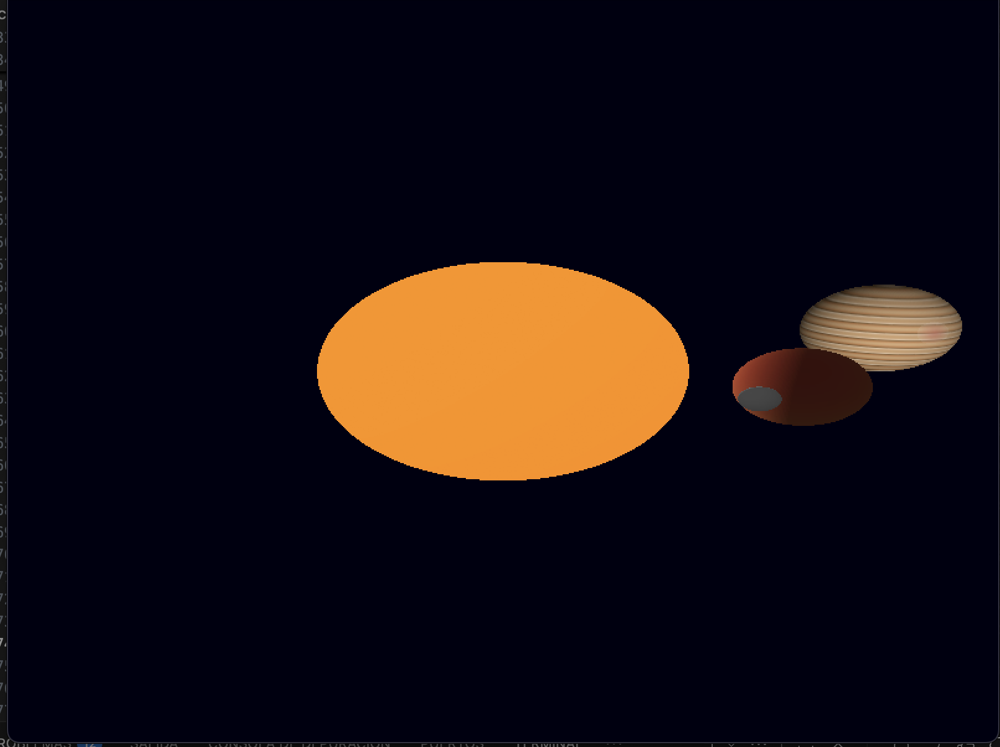
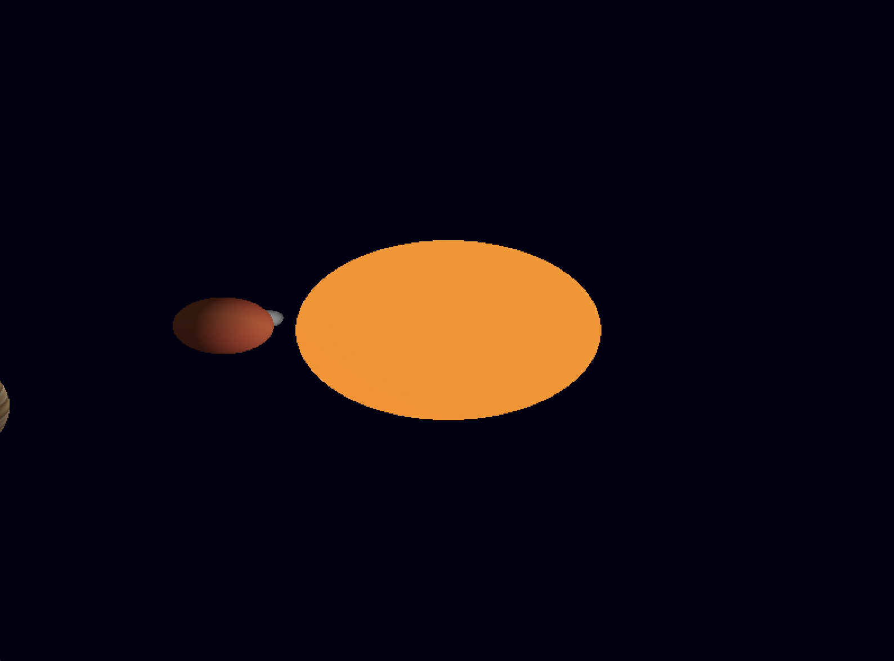
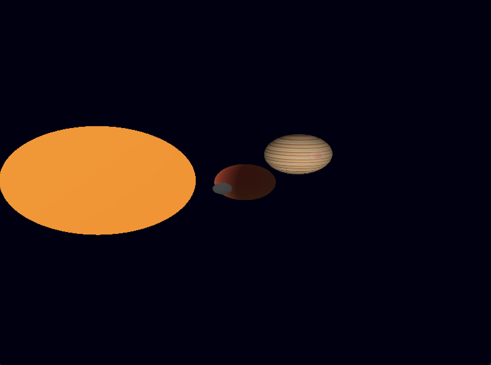
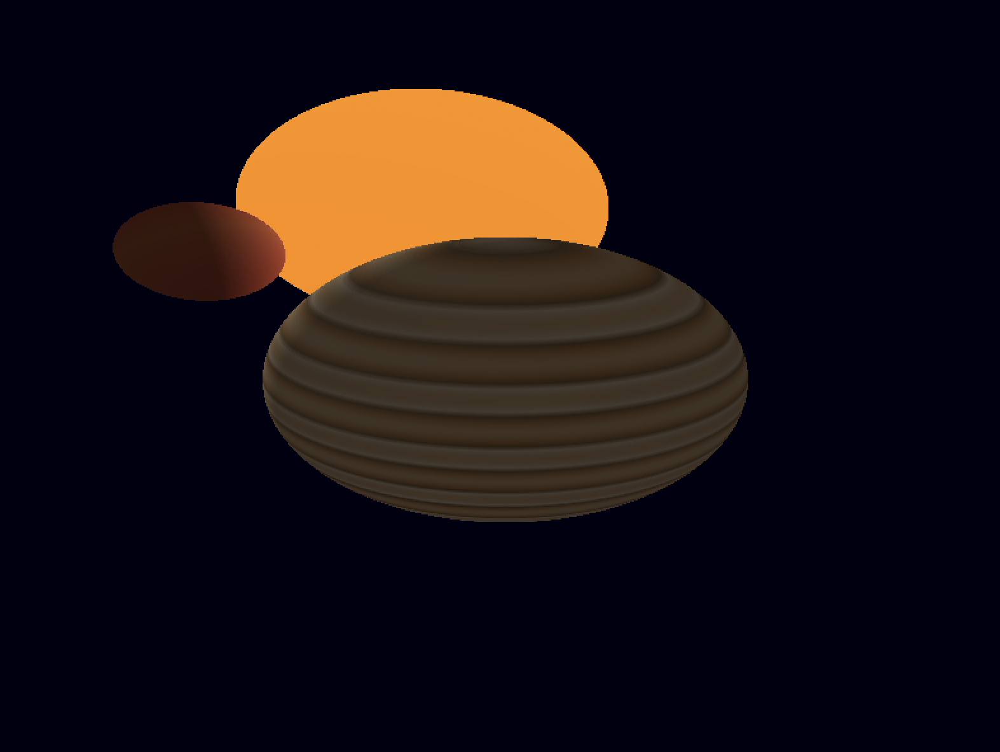

# 🌌 Space Renderer - Solar System Shader Lab

A 3D software renderer built in Rust that showcases procedurally generated celestial bodies using custom fragment shaders. This project demonstrates advanced shader techniques without using textures or external materials.



## ✨ Features

### Celestial Bodies
- **⭐ Sun** - Dynamic plasma effects with animated surface activity and corona glow
- **🌍 Rocky Planet** - Earth-like planet with continents, oceans, mountains, polar ice caps, and animated clouds
- **🪐 Gas Giant** - Jupiter-style planet with horizontal bands, turbulent storms, and the Great Red Spot
- **🌙 Moon** - Detailed lunar surface with craters and varied terrain
- **⭐ Starfield** - Procedurally generated twinkling stars in the background

### Rendering Features
- **Custom Fragment Shaders** - Each celestial body has a unique procedurally generated appearance
- **Multi-layer Shading** - 4+ layers per shader (noise-based terrain, atmospheric effects, detail layers)
- **Procedural Noise** - FastNoiseLite integration for realistic surface generation
- **Z-buffering** - Proper depth sorting for overlapping objects
- **Real-time Animation** - Rotating planets and orbiting bodies

### Interactive Controls
- **Camera System** - Orbital camera with zoom and rotation
- **Manual Rotation** - Rotate any celestial body manually
- **Toggle Animation** - Pause/resume automatic orbital motion
- **Multi-body Selection** - Focus camera on different planets

## 🎮 Controls

### Camera
- `Arrow Keys` - Orbit camera around the scene
- `W / S` - Zoom in/out
- `1` - Focus on Sun
- `2` - Focus on Rocky Planet
- `3` - Focus on Gas Giant

### Manual Rotation (Selected Planet)
- `Q / E` - Rotate around X axis
- `A / D` - Rotate around Y axis
- `Z / C` - Rotate around Z axis

### Animation
- `Space` - Toggle automatic orbit/rotation on/off
- `ESC` - Exit application

## 🚀 Getting Started

### Prerequisites
- Rust (1.70 or higher)
- Cargo (comes with Rust)

### Installation

1. Clone the repository:
```bash
git clone https://github.com/yourusername/space-renderer.git
cd space-renderer
```

2. Ensure you have the sphere model in the correct location:
```
assets/models/sphere.obj
```

3. Build and run:
```bash
cargo run --release
```

The `--release` flag is recommended for better performance.

## 📦 Dependencies

```toml
nalgebra-glm = "0.19.0"    # Linear algebra and 3D math
minifb = "0.28.0"           # Windowing and framebuffer
tobj = "4.0"                # OBJ file loading
rand = "0.9.1"              # Random number generation
fastnoise-lite = "1.1"      # Procedural noise generation
```

## 🎨 Shader Design

### Sun Shader (4 layers)
1. **Radial gradient** - Core to edge color transition (yellow → orange → red)
2. **Plasma animation** - Moving noise patterns for surface activity
3. **Solar spots** - Darker regions simulating sunspots
4. **Corona glow** - Bright edge effect

### Rocky Planet Shader (4 layers)
1. **Base terrain** - Continents vs oceans using noise thresholds
2. **Surface details** - Deserts, forests, and mountains
3. **Polar ice caps** - White regions at high latitudes
4. **Animated clouds** - Moving cloud cover with transparency

### Gas Giant Shader (4 layers)
1. **Horizontal bands** - Striped pattern using sine waves
2. **Turbulence** - Noise-based distortion of bands
3. **Great Red Spot** - Circular storm feature
4. **Fine details** - Swirls and smaller storm systems

### Moon Shader (4 layers)
1. **Base color** - Gray variations
2. **Terrain variations** - Height-based color changes
3. **Craters** - Dark circular impact sites
4. **Surface detail** - Fine texture using high-frequency noise

### Starfield Shader (2 layers)
1. **Star placement** - High noise threshold for sparse distribution
2. **Twinkle effect** - Time-based brightness variation

## 🏗️ Project Structure

```
space-renderer/
├── src/
│   ├── main.rs              # Entry point and render loop
│   ├── camera.rs            # Camera system with orbit controls
│   ├── celestial_body.rs    # Celestial body data structure
│   ├── color.rs             # Color utilities and operations
│   ├── fragment.rs          # Fragment data structure
│   ├── framebuffer.rs       # Pixel buffer and z-buffer
│   ├── obj.rs               # OBJ file loader
│   ├── shaders.rs           # All shader implementations
│   ├── triangle.rs          # Triangle rasterization
│   └── vertex.rs            # Vertex data structure
├── assets/
│   └── models/
│       └── sphere.obj       # 3D sphere model
├── screenshots/             # Project screenshots
├── Cargo.toml
└── README.md
```

## 📸 Screenshots

### The Sun

*Dynamic plasma surface with animated sunspots and corona glow*

### Rocky Planet

*Earth-like world with continents, oceans, and cloud cover*

### Gas Giant

*Jupiter-style planet with bands and the Great Red Spot*

### Full Solar System

*Complete scene with all celestial bodies and starfield*

## 🎯 Technical Highlights

- **No textures used** - All visuals are procedurally generated in real-time
- **Pure software rendering** - No GPU acceleration, demonstrates fundamental graphics concepts
- **Noise-based generation** - Perlin/Simplex noise for natural-looking surfaces
- **Barycentric interpolation** - Smooth gradients across triangle faces
- **Perspective-correct rendering** - Proper 3D projection pipeline

## 🔧 Performance

Running in release mode (`--release`) is highly recommended:
- **Debug mode**: ~15-20 FPS
- **Release mode**: ~60 FPS (depending on hardware)

The renderer is CPU-bound due to software rasterization. Performance can be improved by:
- Reducing sphere polygon count
- Lowering resolution
- Simplifying shader calculations

## 📚 Learning Resources

This project demonstrates:
- Fragment shader programming concepts
- 3D graphics pipeline (vertex shader → rasterization → fragment shader)
- Procedural generation techniques
- Software rendering fundamentals
- Rust graphics programming

## 🎓 Academic Context

Created as part of Computer Graphics coursework at Universidad del Valle de Guatemala (UVG).

**Assignment**: Create 3 celestial bodies (star, rocky planet, gas giant) using only procedural shaders, with creativity and complexity as grading criteria.

**Extra Credit Implemented**:
- ✅ Moon orbiting rocky planet
- ✅ Ring system (starfield background)
- ✅ Additional shader layers beyond minimum requirements

## 🤝 Contributing

This is an academic project, but feedback and suggestions are welcome! Feel free to:
- Report issues
- Suggest shader improvements
- Share your own celestial body designs

## 📄 License

This project is created for educational purposes.

## 👤 Author

**Nicolás Concua**
- GitHub: [@nicoCT4](https://github.com/nicoCT4)
- University: Universidad del Valle de Guatemala

---

⭐ If you find this project interesting, please consider giving it a star!

Made with 🦀 Rust and lots of ☕
